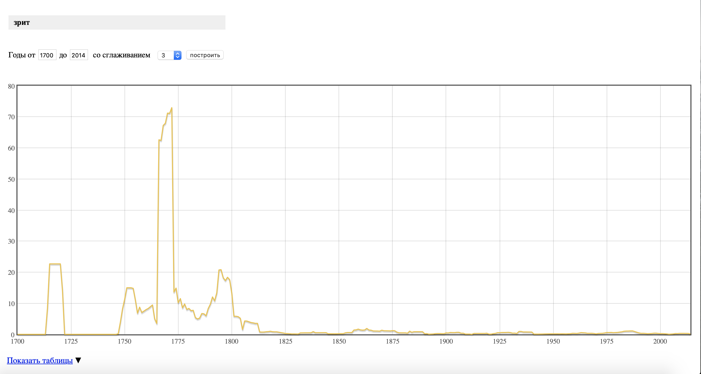

# HW3

1.4)

1.5)

1.6)

2.2)

2.3)
ipm

Зрит: 0,74

Смотрит: 68,94

Гласить: 0,11

Говорить: 274,36

Внемли: 0,42

Слушай: 34,82

3)
Так как для литературоведа часто бывает важен широкий контекст слова и его место в сюжете и в системе образов произведения, изучение возможностей корпуса оказалось для меня полезным. К тому же, моя курсовая работа предполагает частотный анализ переводов Дж. Г. Байрона, так что полученные знания и навыки работы в AntConc имеют для меня практическую пользу.
